# La Strada Café — Menu Platform Architecture (Phase 1)

Version 2.0 · Scope: **QR menu viewing for clients + a single admin who manages categories and products.**
No basket, no orders, no tables, no waiters in this phase. The design is kept light on the database and ready to grow (see section 13).

---

## 1. Purpose and scope

Customers scan **one QR code** and see the café menu: categories, and the products inside each category with image, name and price. A single admin type maintains the menu.

| In scope (Phase 1) | Out of scope (later) |
|---|---|
| Client menu viewing by category | Basket and orders |
| Admin login | Waiter / counter / owner roles |
| Category CRUD, reorder, choose which is first | Table-specific QR codes |
| Product CRUD, price, image, availability | Payments, reports, reservations |

---

## 2. Actors

| Actor | Access | Authentication |
|---|---|---|
| **Client** | Read-only menu | None |
| **Admin** | Full control of categories and products | Login (email/password or PIN, hashed) |

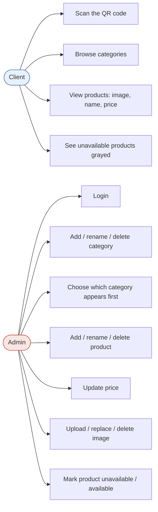

---

## 3. Functional requirements

### 3.1 Client
1. One QR code, printed once and placed on every table, opens `https://<domain>/` (the menu).
2. Categories appear as tabs or a scrollable list, in the order set by the admin. The first category is shown by default.
3. Selecting a category shows its products: image, name, price.
4. A product marked unavailable stays visible but **grayed out** with an "unavailable" label.
5. Products without an image show a neutral placeholder.
6. Mobile-first, fast loading, works on weak connections.

### 3.2 Admin
1. Log in to a protected admin area (`/admin`).
2. **Categories:** create, rename, delete, and choose which one appears first (and reorder the others).
3. **Products:** create, rename, delete, change price, move to another category.
4. **Images:** upload, replace, or delete a product image.
5. **Availability:** toggle a product unavailable/available; it is grayed for clients immediately.
6. Changes appear on the client menu without redeploying anything.

---

## 4. System architecture

Hosting: **Netlify** (frontend), **Render** (backend API), **Neon** (PostgreSQL), all deployed from the café's **GitHub** repository.

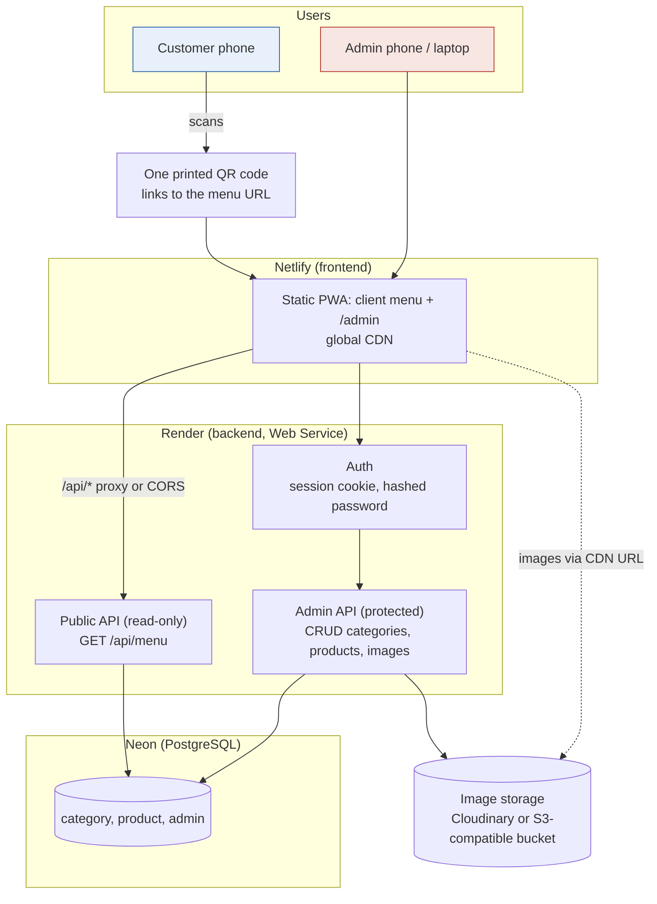

### 4.1 Chosen stack
| Layer | Choice | Reason |
|---|---|---|
| Frontend | Static PWA (React/Vue/Svelte or plain JS) on **Netlify** | Free global CDN, instant deploys from GitHub, HTTPS |
| Backend | Small REST API (Node.js or Python) on **Render** Web Service | Runs the admin logic and the public menu endpoint |
| Database | **Neon** PostgreSQL | Serverless Postgres, branches, generous free tier |
| Images | **External storage** (Cloudinary, or an S3-compatible bucket such as Cloudflare R2) | Render's free filesystem is wiped on every restart, redeploy and spin-down, so uploads cannot live on the server disk |
| Source and CI | **GitHub** repo of the café | Push to `main` deploys both Netlify and Render |

Image storage is the one component not in your list. Because uploaded files would disappear from Render's disk, the database keeps only the image URL or key, and the file itself is stored externally. Check the current free limits of whichever provider you choose.

---

## 5. Data model (database-light)

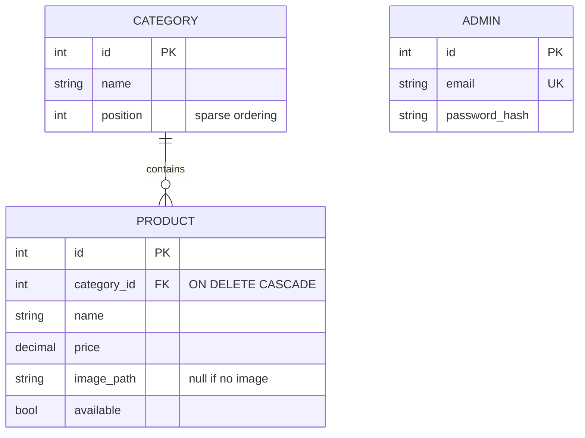

### 5.1 Principles that keep database use low
| Principle | How |
|---|---|
| **Hard delete only** | No `deleted_at`, no `is_deleted`. Deleting a row removes it. |
| **Cascade** | Deleting a category deletes its products in one statement (`ON DELETE CASCADE`). |
| **Image key only** | Images live in external storage (Cloudinary/bucket); the DB stores a short URL or key. |
| **Sparse positions** | `position` uses gaps (1000, 2000, 3000). Putting a category first = **one row update** (`position = min − 1000`), not renumbering everything. |
| **No history tables** | No audit/version tables in this phase. |
| **Two data tables** | `category` and `product` only (plus a single `admin` row). |
| **One read per visit** | The client menu is one query returning categories with their products, cached. |
| **Small row size** | No long descriptions, no JSON blobs, no duplicated data. |

---

## 6. API

### 6.1 Public
| Method | Endpoint | Purpose |
|---|---|---|
| GET | `/api/menu` | Whole menu: categories ordered by position, each with its products |

Response shape:
```json
{
  "version": 42,
  "categories": [
    { "id": 1, "name": "Coffee", "products": [
      { "id": 10, "name": "Espresso", "price": 2.5,
        "image": "/img/10.jpg", "available": true } ] }
  ]
}
```

### 6.2 Admin (login required)
| Method | Endpoint | Purpose |
|---|---|---|
| POST | `/api/admin/login` | Start session |
| POST | `/api/admin/categories` | Create category |
| PATCH | `/api/admin/categories/:id` | Rename |
| PATCH | `/api/admin/categories/:id/move` | Put first / move up or down (updates `position`) |
| DELETE | `/api/admin/categories/:id` | Hard delete category and its products |
| POST | `/api/admin/products` | Create product |
| PATCH | `/api/admin/products/:id` | Update name, price, category, availability |
| DELETE | `/api/admin/products/:id` | Hard delete product and its image |
| PUT | `/api/admin/products/:id/image` | Upload or replace image |
| DELETE | `/api/admin/products/:id/image` | Delete image only |

---

## 7. Client flow

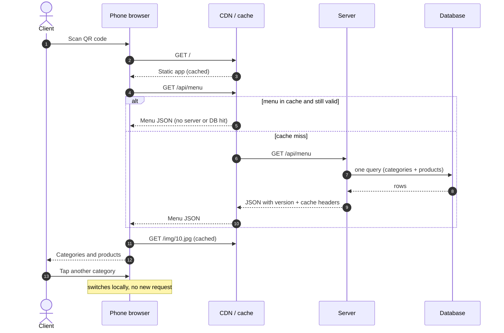

The whole menu is fetched once; switching categories needs no further requests. The phone also keeps a local copy, so a repeat visit shows the menu instantly and refreshes in the background by comparing the `version` number.

---

## 8. Admin flow

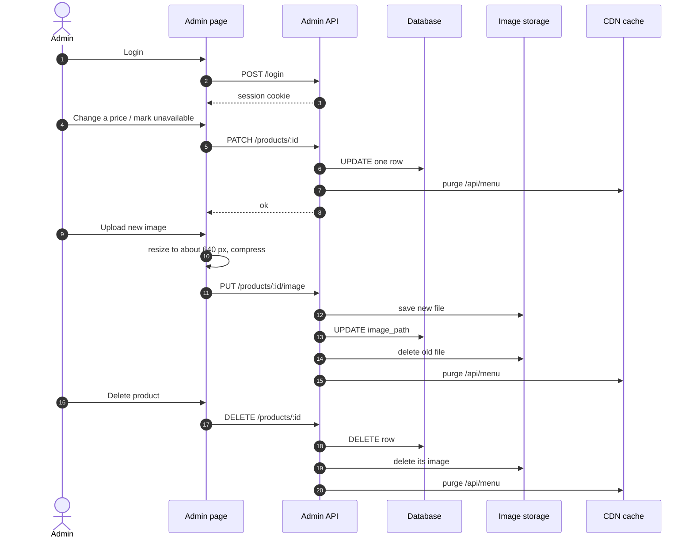

---

## 9. Product availability and image lifecycle

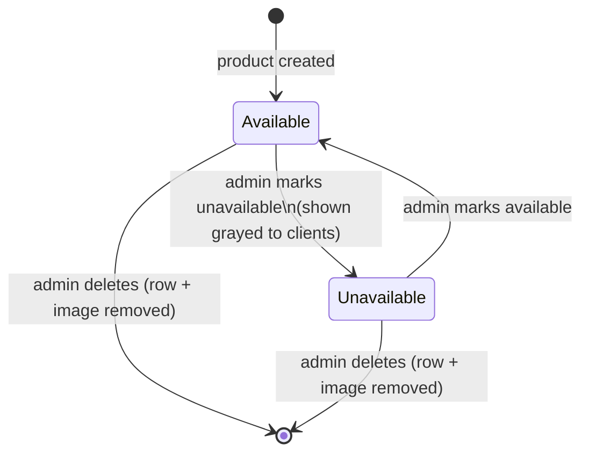

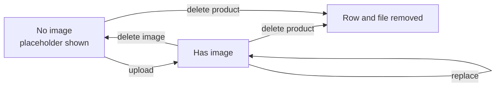

Rules:
- Replacing or deleting an image **deletes the old file** so storage does not accumulate orphans.
- Images are resized and compressed **in the browser before upload** (about 640 px, JPEG/WebP), keeping files small and bandwidth low.
- Unavailable products are **not removed from the response**; the client simply renders them grayed.

---

## 10. Ordering of categories

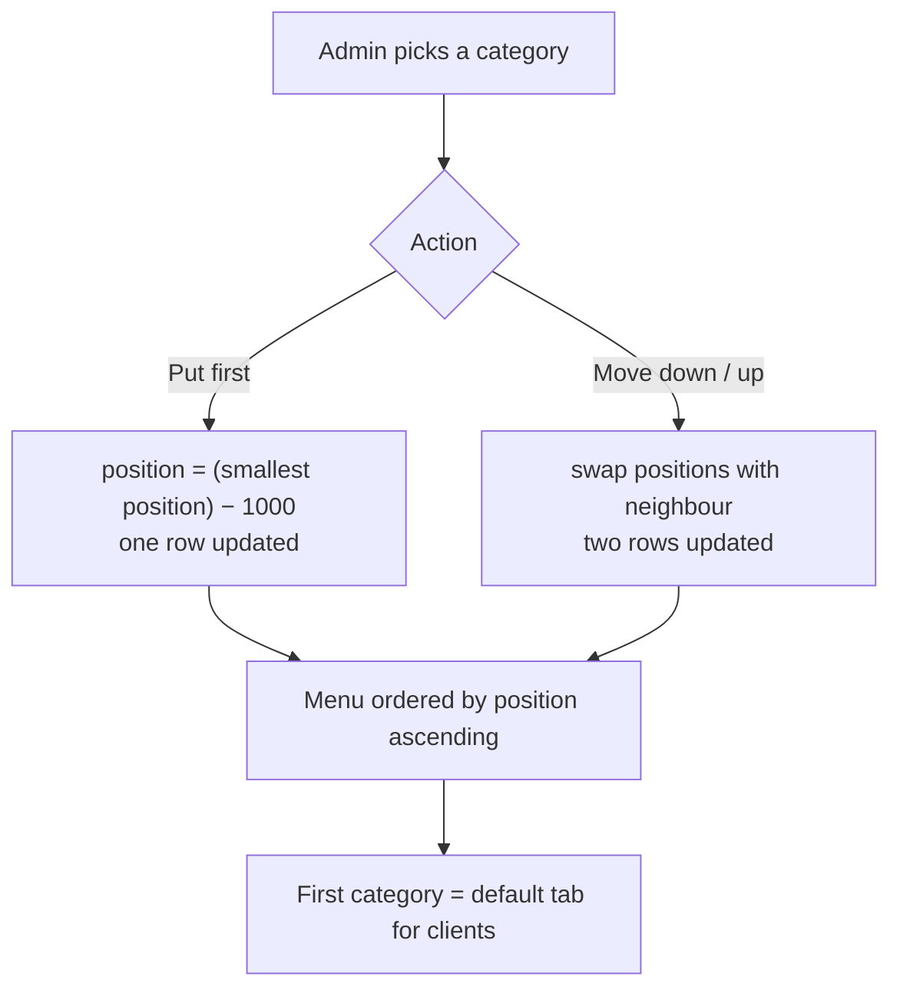

If gaps ever run out, a rare "renumber" step rewrites positions as 1000, 2000, 3000 in one pass.

---

## 11. Deployment (GitHub → Netlify, Render, Neon)

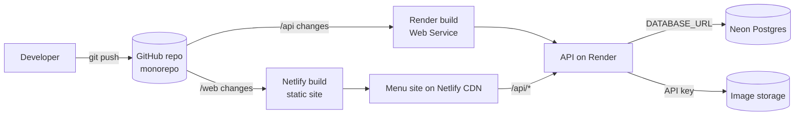

**Repository layout (one GitHub repo)**
```
lastrada/
  web/        frontend (client menu + /admin)   → Netlify (base dir: web)
  api/        backend                           → Render  (root dir: api)
  db/         schema.sql and migrations         → applied to Neon
  README.md
```

**Setup steps**
| Step | Where | Action |
|---|---|---|
| 1 | Neon | Create project, copy the connection string, run `schema.sql` |
| 2 | Render | New Web Service from the GitHub repo, root `api/`; set env vars `DATABASE_URL`, `SESSION_SECRET`, `ADMIN_EMAIL`, `ADMIN_PASSWORD_HASH`, image storage keys, `ALLOWED_ORIGIN` |
| 3 | Netlify | New site from the same repo, base `web/`; add a rewrite `/api/*` → the Render URL, so the browser sees one domain and no CORS or cookie issues |
| 4 | GitHub | Pushes to `main` deploy automatically; use branches for previews |
| 5 | Neon branches | Use a Neon branch as a safe copy of the database for testing |

Secrets stay in Netlify/Render environment variables, never in the repository.

### 11.1 Free-plan behaviour to plan for
| Item | Behaviour | Mitigation |
|---|---|---|
| Render free Web Service | Spins down after 15 minutes without traffic and starts again on the next request, so the first visitor waits (a cold start) | The client app caches the last menu in the phone and shows it instantly; refresh happens in the background |
| Render free instance hours | 750 free hours per month per workspace; services are suspended if exceeded | One service fits in the allowance |
| Render free disk | Ephemeral, wiped on restart, redeploy and spin-down | No files on the server: images in external storage |
| Neon free compute | Scales to zero after a period of inactivity, so the first query after idle is slower | Cache the menu response (below), so most visits never query the database |
| Render free Postgres | Expires after 90 days | Not used: Neon holds the data |

Free-plan limits change, so check Render's and Neon's current documentation before launch. If cold starts become a problem for customers, the Render **paid instance** (always on) is the supported fix, since external pings to keep it awake are not an official solution.

### 11.2 Making the menu fast despite cold starts
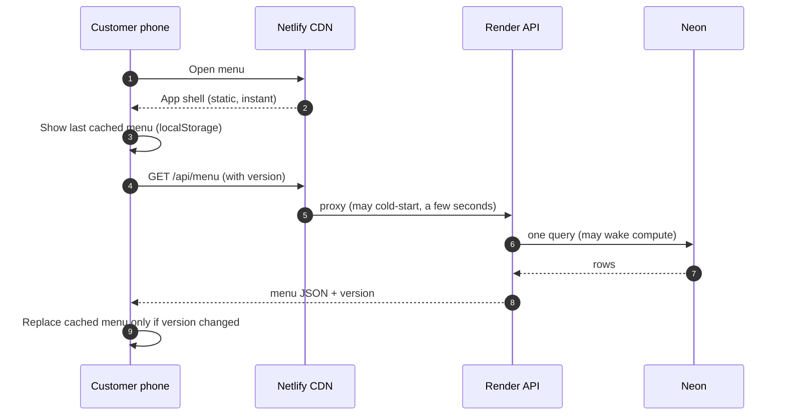
- The phone always displays something immediately: the cached menu on repeat visits.
- The API sends a `version` number that increases on every admin change, so the phone only re-renders when it changed.
- The API also exposes a `/health` endpoint that does **not** touch the database, usable by a monitoring service without waking Neon.
- First-ever visit on a cold backend is the only slow case; consider a paid Render instance once the café is live.

---

## 12. Security, performance and non-functional points

**Security**
- Public API is **read-only**; every write endpoint requires the admin session.
- Passwords stored hashed (argon2/bcrypt); HTTPS only; httpOnly secure cookie; login rate limit.
- Uploads: accept only images, limit size, rename files on the server, never run uploaded content.
- Server validates all inputs (name length, price ≥ 0).
- The single QR code is only a link to a public read-only page, so a photographed QR exposes nothing sensitive.

**Performance and cost**
- The menu JSON and images are cacheable. Most visits never touch the server or database.
- Cache is purged only when the admin changes something.
- A single instance and a free-tier CDN handle a café's traffic.

**Other**
- Languages: French, Arabic (RTL), English labels on the interface; product names are whatever the admin types.
- Currency shown as TND; price stored as decimal.
- Daily backup of the small database and the image folder.

---

## 13. Extensibility (ready for updates)

The structure leaves room for the later features without redesign.

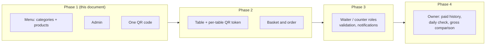

| Later feature | What it adds | Impact on Phase 1 design |
|---|---|---|
| Per-table QR codes | `table` table, QR token in URL | The menu URL gains `/t/<token>`; menu API unchanged |
| Basket and orders | `order`, `order_item` tables (with price snapshot) | Reads `product`; no change to existing tables |
| More roles | `role` column on `admin` | Admin table is already separate |
| Product descriptions or multiple languages | Extra column or `translation` table | Additive migration |
| Product reordering inside a category | `position` column on `product` | Same sparse-position pattern as categories |
| Soft delete (if history is ever needed) | Flag or archive table | Deliberately not used now |

The full architecture for the complete system (orders, waiters, reservations, owner reports, leak detection, QR security) is kept in **`pf-full.md`**.

---

## 14. Implementation roadmap (Phase 1)

| Step | Deliverable |
|---|---|
| 1 | Database (3 tables), admin login |
| 2 | Public `/api/menu` with cache headers |
| 3 | Client menu page: category tabs, product cards, grayed unavailable products |
| 4 | Admin: category CRUD, reorder, put first |
| 5 | Admin: product CRUD, price, availability |
| 6 | Image upload with client-side resize, replace and delete with file cleanup |
| 7 | GitHub → Netlify/Render deploy, Neon schema, image storage, cache version, backups (Neon point-in-time restore or export), print the single QR code |
